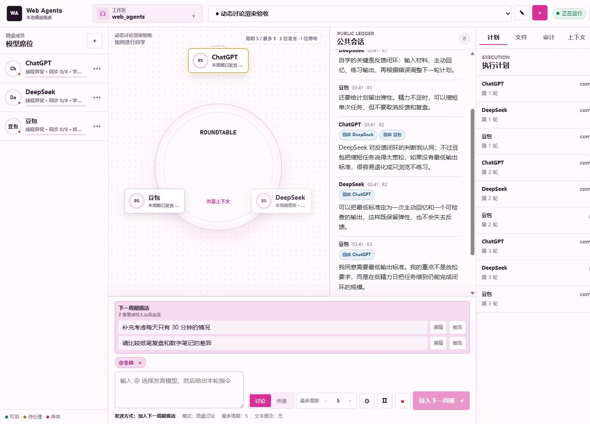

# TableLLM v1

让多个网页大模型围绕同一个命题自然讨论的本地圆桌工作台。

本目录来自独立分支 `tablellm-v1`。稳定基线 `tablellm` 保持不变；插件产品位于 `webagent` / `webagent-v1`，两个产品分支不互相合并。文件安全和权限能力固定依赖独立的 `local-core-v1`。

你给出一个问题，ChatGPT、DeepSeek、豆包等模型先各自形成判断，再根据公共会话继续回应、质疑或修正观点。界面优先展示模型原文；结构化提取和上下文压缩只在程序内部工作，不会把讨论变成一排固定格式的摘要。



## 讨论如何进行

第一周期里，每个席位都要独立发言，避免后发模型过早跟随已有答案。进入下一周期时，同一周期的参与者读取相同的会话快照，因此彼此不会偷看到本周期尚未完成的输出。

后续讨论不要求每个模型机械地重复观点。模型可以展开新论点，也可以用一两句话表示赞同或回应点名；没有值得公开补充的内容时，可以在内部返回 `PASS`，本周期显示为旁听，之后仍能重新加入讨论。

当模型明确提到另一席位时，系统会保留这条回复关系，方便回到被回应的原文。它不会据此推断固定阵营：两位模型可以暂时站在同一边，也可以在后面的周期改变立场。

圆桌没有额外调用一个主持模型。“东家”由现有席位担任，只在讨论结束时负责自然收束；如果东家不可用，系统会从已有席位中选择临时收束者。

## 工作台里有什么

- 圆桌中央显示当前命令，席位状态会区分发言、旁听、等待和异常。
- 公共会话按时间保留原文，点按“回应某模型”可以跳回对应消息。
- 模型生成中的流式内容放在可折叠区域内，并跟随最新内容自动滚动。
- 用户中途补充的内容先进入“下一周期插话”，发送前可以编辑或撤回。
- 每个席位可以设置默认角色，也可以只为本次讨论临时指定角色。
- 讨论达到周期上限或自然完成后，由东家结合原始会话给出收束。

## 快速启动

环境要求：Windows 10/11、Node.js 20 或更高版本，以及已登录所需模型网页的 Chrome 环境。

从仓库根目录运行：

```powershell
.\products\roundtable\start-roundtable.bat
```

也可以只启动工作台服务：

```powershell
npm run start:roundtable
```

默认会使用以下本地端口：

| 服务 | 地址或端口 |
| --- | --- |
| 圆桌工作台 | `http://127.0.0.1:3020` |
| 专用 Chrome CDP | `9223` |
| Playwright MCP | `8931` |

圆桌默认使用独立的 Chrome profile，不会占用日常浏览器会话。兼容扩展是可选通道，不是默认运行依赖。

## 测试

```powershell
npm run test:roundtable
```

只运行不依赖扩展的核心测试：

```powershell
npm --workspace @web-agents/roundtable-product run test:core
```

验证可选的兼容扩展：

```powershell
npm --workspace @web-agents/roundtable-product run test:compat
```

## 本地数据与隐私

工作区会话保存在 `<workspace>/.web-agents`。浏览器 profile、账号状态和运行日志默认位于 `products/roundtable/data`，这些都是本机数据，不应提交到 Git。

仓库中也不应出现个人路径、账号信息、令牌或真实会话内容。用于文档的界面图来自模拟会话。

圆桌实现位于 [`products/roundtable`](products/roundtable)。

## License

MIT
