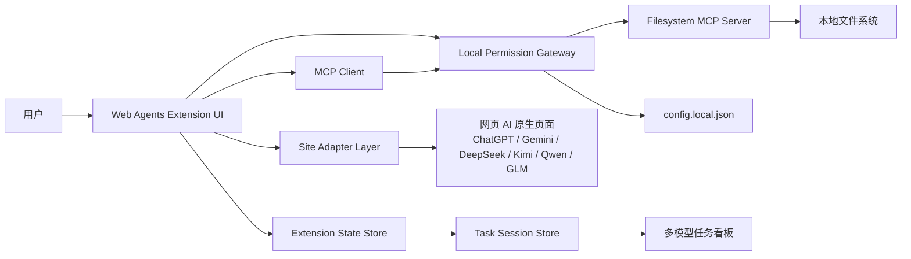
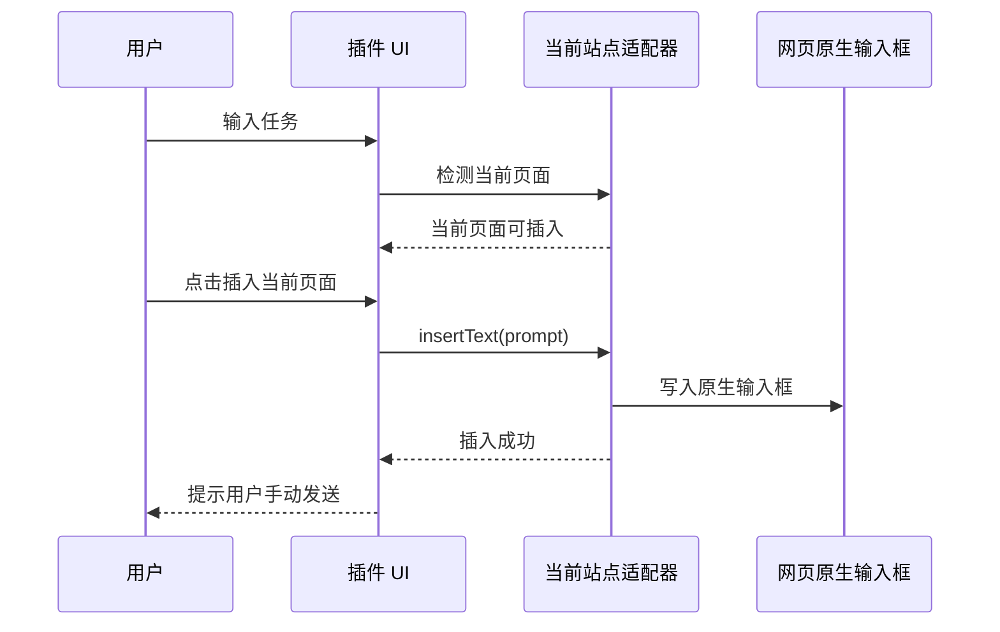
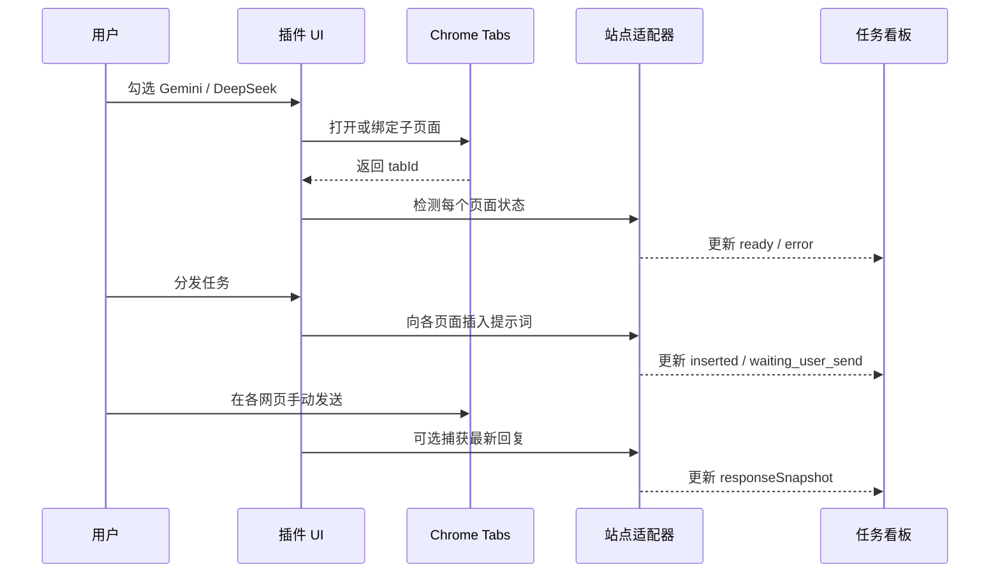
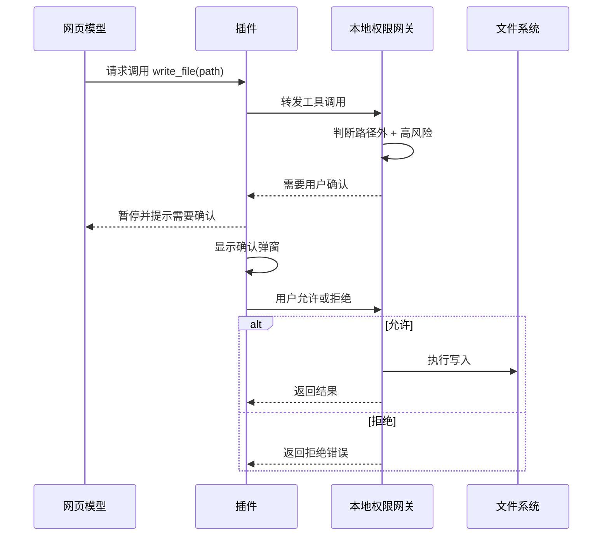

# ARCH: Web Agents 浏览器插件增强架构

## 1. 架构目标

新插件要从“本地魔改扩展包”升级为可维护的浏览器端产品。架构目标是：

- 插件源码可维护、可编译、可扩展。
- 用户默认通过网页原生输入框发送任务。
- MCP 连接、工具列表、权限状态和多模型任务状态在插件侧统一展示。
- 安全边界由本地配置和本地网关执行，插件 UI 不充当唯一安全边界。
- 为后续 GUI Studio、Agent 框架接入、多模型编排保留清晰接口。

## 2. 总体架构



## 3. 模块划分

### 3.1 Extension UI

职责：

- 渲染任务入口。
- 显示当前页面适配状态。
- 显示 MCP 连接状态。
- 显示权限模式和允许路径。
- 管理多模型分发选择。
- 展示任务看板。
- 提供中英文切换。

建议包含：

```text
src/ui/
  panels/TaskPanel.tsx
  panels/PermissionPanel.tsx
  panels/McpPanel.tsx
  panels/MultiModelBoard.tsx
  components/
  i18n/
```

### 3.2 Site Adapter Layer

职责：

- 识别当前网页 AI 站点。
- 检测原生输入框是否可用。
- 将任务文本插入原生输入框。
- 可选：检测发送按钮、等待回复状态、捕获最新回复。

统一接口：

```ts
interface SiteAdapter {
  provider: ProviderId;
  detect(): Promise<AdapterStatus>;
  insertText(text: string): Promise<InsertResult>;
  getLatestResponse?(): Promise<ResponseSnapshot>;
  getPageState?(): Promise<PageState>;
}
```

第一阶段支持：

- 当前页面识别
- 文本插入
- 插入状态回报

第二阶段支持：

- 最新回复捕获
- 页面就绪状态
- 自动发送高级选项

### 3.3 MCP Client

职责：

- 连接本地 MCP 服务。
- 支持 SSE 作为第一优先传输。
- 获取 tools 列表。
- 后续扩展 resources、prompts、Streamable HTTP、WebSocket。
- 将工具 schema 归一化给 UI 展示。

当前可参考 `extensions/mcp-superassistant-local-fixed/background.js` 中已有 MCP 客户端行为，但新插件应在源码工程中重新封装。

### 3.4 Local Permission Gateway

职责：

- 读取和写入本地配置。
- 管理允许路径。
- 执行权限模式。
- 区分只读工具和变更工具。
- 对路径外变更操作发起确认。
- 在最高权限模式下持续返回高风险状态。

重要原则：

```text
插件 UI 可以提示和确认，但真正放行/拒绝必须由本地网关决定。
```

原因：

- 网页模型可能生成错误或恶意工具调用文本。
- 浏览器 UI 状态可能被跳过或不同步。
- 本地文件安全必须由靠近文件系统的一层控制。

### 3.5 Task Session Store

职责：

- 保存当前任务。
- 保存参与模型列表。
- 保存每个模型的 tabId、provider、状态。
- 保存已插入提示词和最新回复快照。
- 支持多模型任务看板渲染。

建议数据结构：

```ts
type TaskSession = {
  id: string;
  title: string;
  prompt: string;
  createdAt: string;
  participants: ModelParticipant[];
};

type ModelParticipant = {
  provider: ProviderId;
  tabId?: number;
  url?: string;
  enabled: boolean;
  status:
    | "not_open"
    | "opening"
    | "ready"
    | "inserted"
    | "waiting_user_send"
    | "waiting_response"
    | "captured"
    | "error";
  insertedPrompt?: string;
  responseSnapshot?: ResponseSnapshot;
  error?: string;
};
```

## 4. 权限模型

默认权限模式为标准模式。

```text
allowedRoots 内：
  - 读取：允许
  - 写入：允许
  - 删除/移动/覆盖：允许，但 UI 可提示风险

allowedRoots 外：
  - 浏览/列目录：允许
  - 读取文件：允许
  - 写入/删除/移动/重命名/覆盖/新建目录：必须确认

最高权限模式：
  - 用户手动开启
  - 本地配置记录
  - UI 持续展示高风险状态
  - 可设置会话级或限时开启
```

工具风险分级：

```text
低风险：
  list_directory
  read_file
  search_files
  get_file_info

高风险：
  write_file
  edit_file
  delete_file
  move_file
  rename_file
  create_directory
```

如果 MCP 工具名称不同，本地网关应通过工具 metadata、配置映射或默认规则归类。

## 5. 配置同步

配置采用“本地配置 + 插件 UI 同步”。

安全源头：

```text
config.local.json
Local Permission Gateway
```

插件 UI：

```text
读取配置
展示配置
请求修改配置
显示同步结果
```

建议配置结构：

```json
{
  "extension": {
    "locale": "zh-CN",
    "defaultExecutionMode": "insert_only",
    "autoSendEnabled": false
  },
  "permissions": {
    "mode": "standard",
    "allowedRoots": ["F:\\web_agents"],
    "highPrivilege": {
      "enabled": false,
      "expiresAt": null
    }
  },
  "mcp": {
    "serverUri": "http://127.0.0.1:3006/sse",
    "transport": "sse"
  },
  "providers": {
    "chatgpt": { "enabled": true },
    "gemini": { "enabled": true },
    "deepseek": { "enabled": true },
    "kimi": { "enabled": false },
    "qwen": { "enabled": false },
    "glm": { "enabled": false }
  }
}
```

## 6. 执行流程

### 6.1 当前页面插入



### 6.2 多模型显式分发



### 6.3 路径外高风险操作确认



## 7. UI 信息架构

第一阶段建议：

```text
Web Agents 面板
  任务
    - 任务输入
    - 插入当前页面
    - 多模型分发入口
  当前页面
    - provider
    - 适配状态
    - 输入框状态
  本地 MCP
    - 连接状态
    - Server URI
    - 工具数量
  权限
    - 标准模式
    - 允许路径
    - 高风险开关
  工具
    - tools
    - resources
    - prompts
  设置
    - 语言
    - 自动发送高级选项
    - Provider 管理
```

## 8. 国际化设计

语言包建议：

```text
src/i18n/zh-CN.json
src/i18n/en.json
```

要求：

- 默认中文。
- 所有用户可见文案都必须走 i18n key。
- 错误提示不能直接暴露英文底层异常，应提供中文解释和技术详情展开。
- manifest 名称和描述使用 `_locales/zh_CN` 与 `_locales/en`。

## 9. 工程结构建议

```text
extensions/
  mcp-superassistant-local-fixed/   # 当前参考/短期可用版本
  web-agents-extension/             # 新插件源码工程
    manifest.json
    package.json
    src/
      background/
      content/
      adapters/
      ui/
      mcp/
      permissions/
      sessions/
      i18n/
```

## 10. 分期计划

### Phase 1: Provider Adapter Foundation

- 建立唯一 provider catalog。
- 拆分 content script、DOM helper 和 runtime adapter。
- 支持 ChatGPT、Gemini、DeepSeek、Kimi、GLM、Qwen、豆包、Grok、Google AI Studio 的基础识别和插入规则。
- 保持默认 insert-only，不自动发送。
- 建立 Vitest/jsdom 测试基线。

### Phase 2: 权限与配置同步

- 增加本地权限网关。
- 配置文件 + 插件 UI 同步。
- 标准权限模式。
- 路径外变更操作确认。

### Phase 3: 多模型任务看板

- 模型显式勾选。
- 手动打开子页面。
- 多页面插入任务。
- 任务状态卡片。
- 最新回复快照。

### Phase 4: Agent Studio 铺垫

- 会话保存到本地 agent-session。
- 多模型横向对比。
- 自动汇总。
- Agent runtime adapter 接口。

## 11. 主要风险

- 网页 DOM 改版会导致站点适配器失效。
- 自动发送容易触发网页风控，因此默认不启用。
- 权限确认如果只在插件 UI，会存在绕过风险，必须落到本地网关。
- 不同 MCP filesystem server 的工具名称和行为可能不同，需要工具风险映射层。
- 多模型回复捕获无法保证所有网页结构完全一致，第一版应只承诺最新回复快照。

## 12. 验证策略

- 使用 Chrome 加载新插件源码构建产物。
- 在 Gemini / DeepSeek / ChatGPT 页面验证当前页面插入。
- 启动本地 MCP SSE 服务，验证连接状态和 tools/list。
- 模拟路径外高风险操作，验证确认流程。
- 切换中文/英文，确认所有主要 UI 文案切换。
- 多模型模式下，验证默认只选择当前页面，其他模型必须手动勾选和打开。
