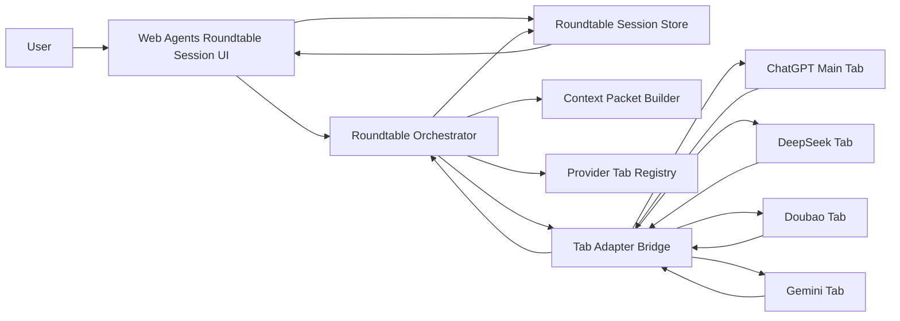

# Multi-Model Roundtable Session Design

## Summary

Web Agents should evolve from a browser-extension helper into a multi-model roundtable session application. The browser extension remains the first delivery surface, but the product center is an independent Web Agents conversation window that coordinates ChatGPT, DeepSeek, Doubao, and Gemini as participants.

In this model, provider pages are not the source of truth for the discussion. They are external model endpoints controlled through browser tabs. Web Agents owns the shared session ledger, prepares the context sent to each provider, captures replies, and appends them back into the shared session.

The first supported scenario is:

1. The user is on a ChatGPT page and asks a question in the main page.
2. ChatGPT answers in the main page.
3. The user opens Web Agents and starts a roundtable discussion from the current ChatGPT page.
4. Web Agents imports recent main-window conversation context.
5. The user asks DeepSeek to discuss with GPT for five rounds and produce a plan.
6. Web Agents automatically moves messages between ChatGPT and DeepSeek, optionally allowing Doubao and Gemini to join later.
7. The final summary is sent back to ChatGPT, which acts as the main-window synthesizer.

## Product Direction

The final product shape is an application-like session workspace:

- A standalone Web Agents session window shows the shared conversation.
- Browser provider pages are adapters, not the primary UI.
- The session can later become a desktop app, web app, or Agent Studio surface.
- The extension version should use the same session data model and orchestration concepts as the future app.

## Goals

- Provide one shared discussion context visible to GPT, DeepSeek, Doubao, Gemini, and the user.
- Start a discussion by importing recent context from the current ChatGPT main window.
- Let the user select participants and set an automatic discussion objective.
- Automatically send prompts, capture replies, advance rounds, and stop safely on failure.
- Allow the user to interrupt, add guidance, add a new participant, pause, resume, or ask for a final GPT summary.
- Preserve enough state that the plugin window can explain what is happening and recover from partial failures.

## Non-Goals For The First Version

- It will not promise perfect full-history extraction from every provider page.
- It will not replace the native provider chat pages.
- It will not run without already-open authenticated provider pages unless the user opens them through Web Agents.
- It will not support arbitrary provider counts in the first UI. The first roundtable is ChatGPT, DeepSeek, Doubao, and Gemini.
- It will not solve all provider anti-automation issues. The orchestrator must pause when a site cannot be sent to or captured reliably.

## User Experience

### Primary UI

The Web Agents panel should contain a dedicated roundtable session surface.

Left control rail:

- Session title.
- Main window binding, usually `ChatGPT 主窗口 已绑定`.
- Imported-context status, for example `已搬运最近 8 条记录`.
- Participant list:
  - GPT: main controller and final summarizer.
  - DeepSeek: active participant.
  - Doubao: optional participant.
  - Gemini: optional participant.
- Automation status:
  - round count, such as `2 / 5`.
  - next action, such as `发给 GPT`.
  - controls: start, pause, resume, final summary.

Main session area:

- A chat-like shared discussion ledger.
- Messages are labeled by speaker: user, GPT, DeepSeek, Doubao, Gemini, system.
- User can type a new instruction into the Web Agents session, such as `让 Gemini 也加入，重点审查落地风险。`.
- The entered instruction is appended to the shared ledger and included in future provider prompts.

### Starting A Roundtable

1. User opens ChatGPT and asks a question.
2. User opens Web Agents.
3. User clicks `启动圆桌讨论`.
4. Web Agents captures the latest ChatGPT conversation context.
5. Web Agents creates a `RoundtableSession`.
6. User selects participants, defaulting to GPT and DeepSeek for the first MVP flow.
7. User provides an orchestration instruction, for example:
   `你怎么看？你和 GPT 讨论五轮，最后由 GPT 给我一个方案。`
8. User clicks `开始自动讨论`.

### Automatic Discussion

For each round:

1. Web Agents chooses the next target participant.
2. Web Agents builds a context packet from the shared ledger.
3. Web Agents inserts and attempts to send the packet in that participant's provider page.
4. Web Agents waits for a reply.
5. Web Agents captures the reply.
6. Web Agents appends the reply to the shared ledger.
7. Web Agents advances to the next target participant.

When the planned rounds are complete, Web Agents sends a final summary prompt to GPT in the main window.

### Mid-Discussion User Guidance

The user can add a message to the Web Agents session at any time. The message becomes a ledger entry and is included in the next context packet.

Example:

`让 Gemini 也加入，重点审查落地风险。`

If Gemini is not open, Web Agents should show that Gemini needs to be opened. Once opened and ready, Gemini receives:

- the imported main-window context,
- the shared discussion so far,
- the latest user guidance,
- its role-specific instruction.

## Architecture



## Core Modules

### Roundtable Session UI

Responsibilities:

- Show the independent Web Agents conversation window.
- Show participant readiness and automation status.
- Let the user import main-window context.
- Let the user add participants.
- Let the user start, pause, resume, or summarize.
- Let the user add mid-discussion guidance.

Likely location:

```text
extensions/web-agents-extension/src/ui/panels/RoundtableSessionPanel.tsx
```

### Roundtable Session Store

Responsibilities:

- Own the shared discussion ledger.
- Persist roundtable state in extension storage.
- Track participants, tabs, rounds, next action, and failures.
- Provide serializable state for UI and background orchestration.

Likely location:

```text
extensions/web-agents-extension/src/sessions/roundtable.ts
```

### Roundtable Orchestrator

Responsibilities:

- Decide the next participant.
- Generate context packets.
- Send packets to provider tabs.
- Poll or request latest response capture.
- Append captured responses to the session ledger.
- Pause on failures and expose a recoverable state.

Likely location:

```text
extensions/web-agents-extension/src/background/roundtable-orchestrator.ts
```

### Context Packet Builder

Responsibilities:

- Convert session ledger entries into model-specific prompts.
- Keep packets under a configurable character budget.
- Include role instructions and the user's latest orchestration goal.
- Summarize or trim older messages when needed.

Likely location:

```text
extensions/web-agents-extension/src/sessions/context-packet.ts
```

### Provider Tab Adapter Bridge

Responsibilities:

- Reuse existing `tab:insert-text`, `tab:capture-latest`, and provider detection.
- Add a controlled auto-send path for roundtable automation.
- Return structured statuses: inserted, sent, no_input, no_submit, capture_timeout, captured.

Likely locations:

```text
extensions/web-agents-extension/src/shared/messages.ts
extensions/web-agents-extension/src/content/auto-submit.ts
extensions/web-agents-extension/src/content/index.ts
```

## Data Model

```ts
type RoundtableRole = "main" | "participant" | "summarizer";

type RoundtableParticipantState =
  | "not_open"
  | "opening"
  | "ready"
  | "sending"
  | "waiting_response"
  | "captured"
  | "paused"
  | "error";

type RoundtableMessage = {
  id: string;
  sessionId: string;
  provider?: ProviderId;
  speaker: "user" | "system" | ProviderId;
  text: string;
  source: "main_window_import" | "web_agents_user" | "provider_capture" | "orchestrator";
  round?: number;
  createdAt: string;
};

type RoundtableParticipant = {
  provider: ProviderId;
  label: string;
  role: RoundtableRole;
  enabled: boolean;
  tabId?: number;
  url?: string;
  state: RoundtableParticipantState;
  lastSentMessageId?: string;
  lastCapturedMessageId?: string;
  error?: string;
};

type RoundtablePlan = {
  objective: string;
  maxRounds: number;
  currentRound: number;
  nextProvider?: ProviderId;
  finalSummarizer: ProviderId;
  mode: "automatic";
};

type RoundtableSession = {
  id: string;
  title: string;
  mainProvider: ProviderId;
  mainTabId?: number;
  createdAt: string;
  updatedAt: string;
  importedContextAt?: string;
  state: "draft" | "ready" | "running" | "paused" | "summarizing" | "complete" | "error";
  participants: RoundtableParticipant[];
  plan: RoundtablePlan;
  messages: RoundtableMessage[];
};
```

## Context Packet Format

Each packet sent to a provider should be explicit that the provider is participating in a mediated Web Agents discussion.

Template:

```text
你正在参与一个由 Web Agents 编排的多模型圆桌讨论。

本轮目标：
{objective}

你的身份：
{providerRole}

共享讨论上下文：
{recentLedger}

本轮请你完成：
{turnInstruction}

请直接给出你的观点，不要假装你能看到其他网页。你看到的是 Web Agents 提供的共享上下文。
```

For GPT final summary:

```text
你是本次 Web Agents 圆桌讨论的主窗口汇总者。

请基于以下共享讨论记录，输出一个可执行方案：
{recentLedger}

要求：
- 先给结论。
- 再给开发路线。
- 再给风险和验证方式。
- 最后给下一步行动清单。
```

## Orchestration Rules

### Initial MVP Route

The first route should support:

```text
GPT main window -> DeepSeek -> GPT -> DeepSeek -> GPT ... -> GPT final summary
```

Doubao and Gemini can join once the base loop works.

### Participant Join Rule

When a new participant joins mid-discussion:

- It receives the latest context packet before being asked for an opinion.
- Its first instruction should explain that it is joining late.
- Its reply is appended to the same ledger.
- The orchestrator can then include it in future rounds.

### Stop Conditions

The orchestrator must pause instead of looping when:

- no writable input is found,
- no usable send control is found after bounded retries,
- response capture times out,
- the provider page is not ready,
- the user manually pauses,
- the same action fails twice consecutively for the same provider,
- the session reaches `maxRounds`.

### Recovery Actions

When paused, the UI should offer:

- retry current step,
- skip participant for this round,
- insert manually,
- capture manually,
- send final summary to GPT,
- stop session.

## Main Window Context Import

The first version should import recent context from the main ChatGPT page using the existing response capture foundation, extended to collect a bounded set of recent user and assistant turns.

Minimum acceptable first version:

- capture latest ChatGPT assistant response,
- include the user's current or manually supplied original question,
- store both as imported context messages.

Better version:

- capture the latest 6-10 visible conversation turns,
- normalize each message as user or assistant when possible,
- fall back to unlabeled text blocks when provider-specific labels are unavailable.

The UI must show what was imported and allow the user to re-import.

## Integration With Current Code

Current available foundation:

- Provider catalog exists for ChatGPT, DeepSeek, Gemini, Doubao, and others.
- Multi-model board already opens provider tabs, inserts text, and captures latest replies.
- Content script has an auto-submit helper with bounded retries.
- Background script routes messages to provider tabs.

Required additions:

- New roundtable session data model.
- New UI panel or mode for the standalone session window.
- Background orchestration API.
- Context import API.
- Capture-multiple-recent-messages API.
- Safer auto-send status reporting for orchestrator use.

## Message API Additions

Proposed request types:

```ts
| { type: "roundtable:create"; mainProvider: ProviderId; mainTabId?: number; objective: string }
| { type: "roundtable:import-main-context"; sessionId: string; tabId?: number }
| { type: "roundtable:add-user-message"; sessionId: string; text: string }
| { type: "roundtable:add-participant"; sessionId: string; provider: ProviderId; tabId?: number }
| { type: "roundtable:start"; sessionId: string }
| { type: "roundtable:pause"; sessionId: string }
| { type: "roundtable:resume"; sessionId: string }
| { type: "roundtable:step"; sessionId: string }
| { type: "roundtable:summarize"; sessionId: string }
| { type: "roundtable:get"; sessionId: string }
```

Proposed tab-level additions:

```ts
| { type: "tab:auto-send-text"; text: string; tabId?: number }
| { type: "tab:capture-recent"; tabId?: number; limit?: number }
```

## Testing Strategy

Unit tests:

- context packet builder trims and preserves latest guidance,
- session store appends messages in order,
- orchestrator advances route correctly,
- orchestrator pauses on no-submit and capture-timeout,
- mid-session participant join receives prior context,
- final GPT summary packet includes all recent participant messages.

Content tests:

- auto-send returns structured states without repeated input flashing,
- capture-recent extracts bounded visible messages in jsdom fixtures,
- provider-specific selectors remain compatible with current catalog entries.

UI tests:

- roundtable panel renders participants and ledger,
- start/pause/resume controls call expected messages,
- adding Gemini mid-session updates state and ledger,
- imported context preview appears before automation starts.

Manual verification:

- Start on ChatGPT page.
- Ask the sample project-route question.
- Import main context.
- Open DeepSeek.
- Run a two-round discussion first.
- Verify both GPT and DeepSeek receive shared context.
- Add Gemini mid-session.
- Verify Gemini receives recent shared ledger.
- Send final summary to GPT.

## MVP Acceptance Criteria

- User can start a Web Agents roundtable session from a ChatGPT page.
- Web Agents imports and displays recent main-window context.
- User can enable DeepSeek as a participant and open/bind its tab.
- User can start an automatic GPT <-> DeepSeek discussion with a configured round count.
- Each model receives a prompt that includes the shared Web Agents ledger.
- Captured replies appear in the plugin's independent session window.
- User can pause the automation at any time.
- Automation pauses with a clear error instead of looping endlessly when send or capture fails.
- User can ask GPT to generate a final summary from the shared ledger.

## Later App Evolution

The same session model should support a future standalone app:

- Browser extension becomes one connector among many.
- Desktop app owns long-term session history.
- Provider adapters can include browser tabs, APIs, local agents, or remote agents.
- Roundtable sessions become project artifacts with saved decisions, plans, and final reports.
- Local gateway becomes the permission and execution boundary for files, tools, and agent actions.

## Open Design Decisions

The following decisions are fixed for the first implementation:

- Automation target is B: automatic discussion with safe pause and recovery.
- The product center is a standalone Web Agents session window.
- The shared ledger is the source of truth for multi-model context.
- GPT is the first main-window provider and final summarizer.
- DeepSeek is the first secondary participant.
- Doubao and Gemini are supported as joinable participants after the base loop works.

