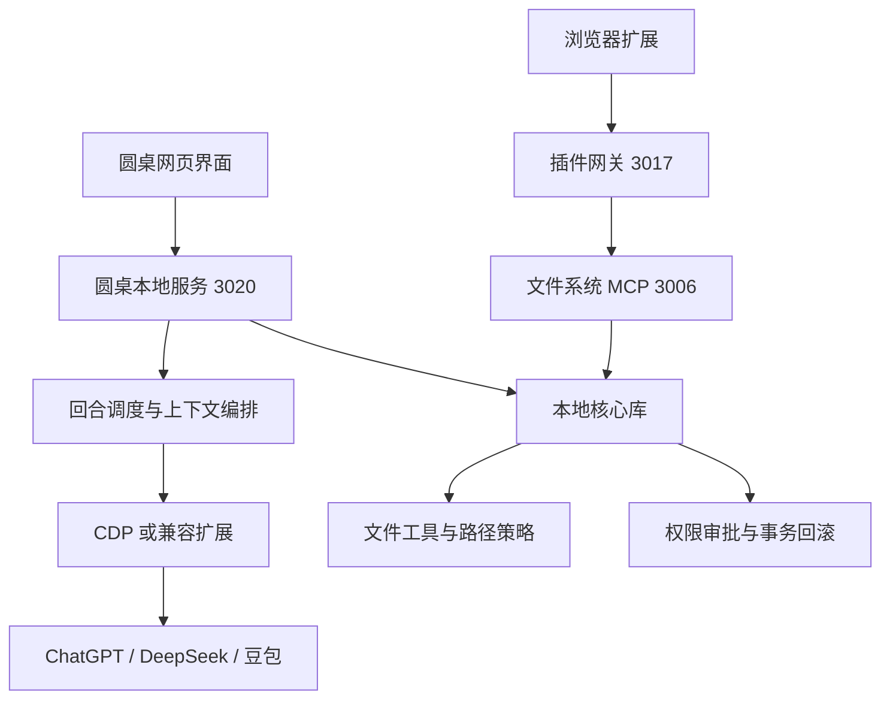

# 架构总览

## 仓库定位

仓库包名为 `web-ai-local-mcp-bridge`，采用 Node.js 原生模块（`type: module`），要求 Node.js `>=24`。工作区由 `packages/*`、`products/*` 和 `products/*/*` 组成。

## 功能分区

| 语义区域 | 代码位置 | 主要职责 |
| --- | --- | --- |
| 本地安全与文件能力 | `packages/local-core` | 路径校验、文件工具、权限审批、工具注册、事务回滚 |
| 圆桌工作台 | `products/roundtable` | 多模型会话、提示词与回合调度、浏览器驱动、工作区存储、网页界面 |
| 插件与本地网关 | `products/plugin` | Chrome 扩展、结果增强、插入回退、文件系统 HTTP/stdio 服务和权限网关 |
| 工程支撑 | `tools`、`scripts`、`config`、各产品 `test` | 边界检查、启动脚本、配置解析和回归测试 |

## 运行时关系

## 关键边界

- 圆桌产品可以直接使用 `@web-agents/local-core`，但不启动或依赖插件端口 `3006/3017`。
- 插件产品负责扩展和本地网关，不打包圆桌工作台。
- 圆桌默认使用专用 Chrome 配置目录，通过 CDP `9223` 和 Playwright 驱动；兼容扩展模式是单独的桥接路径。
- 工作区会话数据写入 `<工作区>/.web-agents`；产品浏览器状态和日志默认位于 `products/roundtable/data`。
- 文件写入必须经过核心库的允许目录、权限和事务链路，不能绕过控制器能力直接修改外部工作区。

## 主要数据流

1. 用户在圆桌界面输入指令，`command-parser` 解析模型席位、引用、轮数和会话模式。
2. `scheduler` 将指令拆成回合计划，按席位投影上下文并交给浏览器 worker。
3. provider adapter 负责各模型页面的定位、输入和完成检测；事件由 `event-bus` 回传。
4. 工具调用进入 MCP tool loop，再经权限 broker、事务 manager 和文件工具执行。
5. 回复、产物、事务和会话状态由 `LocalWorkspaceStore` 持久化，网页通过 HTTP API 和事件流刷新。
